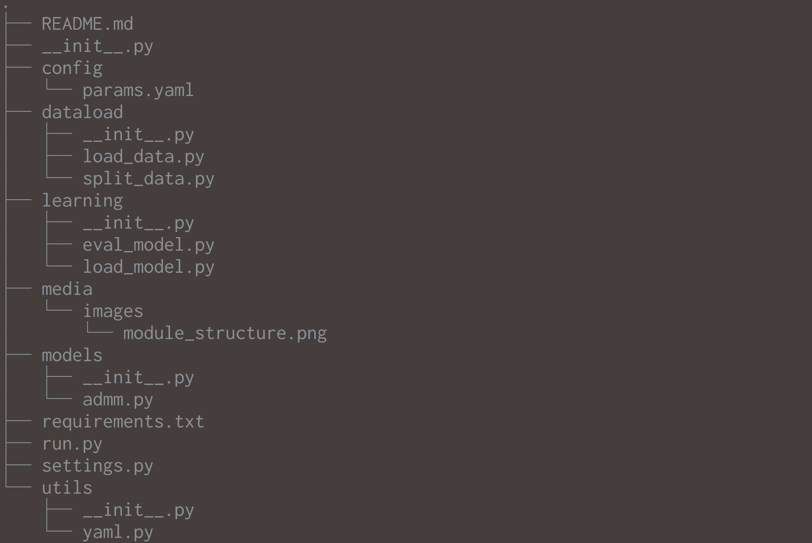

# Structure



# Requirements

## Python

All the Python scripts are supported by ```Python 3.5.3``` or later.

(*Option*) It is recommended that you have a virtual environment with ```pyenv``` and ```pyenv-virtualenv```.

## Libraries and Packages

```numpy 1.13.3```, ```scikit-learn 0.19.1``` and ```PyYAML 3.12``` are required. Use the ```pip``` command and install the packages as follows:

```bash
pip install -r requirements.txt
```

# Sample Main Script

Run

```bash
python run.py params.yaml
```

with the config file in YAML format located under the ```config``` directory.

## Note

As of 5/12/2018, only the [Boston house-prices dataset](http://scikit-learn.org/stable/modules/generated/sklearn.datasets.load_boston.html) is available.

# Reference

Hastie, Trevor, et al. *Statistical Learning with Sparsity: the Lasso and Generalizations*. CRC Press, Taylor & Francis Group, 2015.
